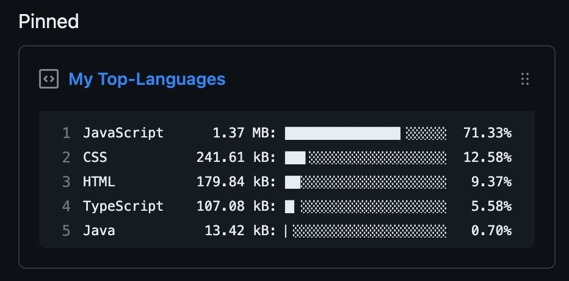

# Top-Language-Box

Result

The project allows you to pin the language you use most frequently.

## Setup

Step 1: Fork this repository and enable actions in the action tab.

Step 2: [Generate a gist](https://gist.github.com/).

Step 3: Go to settings > secrets and variables > Actions and add secrets GH_TOKEN, GH_GISTID.

GH_TOKEN: Verify repo and gist [here](https://github.com/settings/tokens).

GH_GISTID: https://gist.github.com/Suk0803/ **f5ebdde2b6a31849520797f9f4e49831** <<Use this part.

Inspered by[github_readme_state](https://github.com/anuraghazra/github-readme-stats#top-languages-card) and [productive-box](https://github.com/maxam2017/productive-box).
