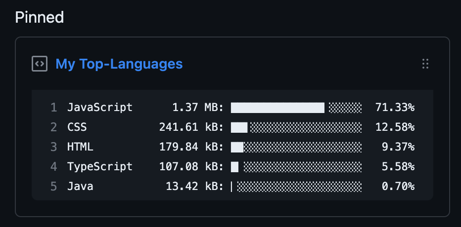

# Top-Language-Box

Result



The project allows you to pin the language you use most frequently.

## Setup

### Step 1: Fork this repository

Fork this repository and enable GitHub Actions in the Actions tab.

### Step 2: Create a Gist

1. Go to [gist.github.com](https://gist.github.com/)
2. Create a new gist with any filename (e.g., `top-language-usage.txt`)
3. Add some initial content
4. Create the gist (can be public or secret)
5. Copy the gist ID from the URL

Example: `https://gist.github.com/username/`**`f5ebdde2b6a31849520797f9f4e49831`** ← Use this part

### Step 3: Generate a GitHub Personal Access Token

1. Go to [GitHub Settings → Tokens](https://github.com/settings/tokens)
2. Click **"Generate new token"** → **"Generate new token (classic)"**
3. Give it a descriptive name (e.g., "Top-Language-Box")
4. Select the following scopes:
   - ✅ **`gist`** - Create gists
   - ✅ **`repo`** - Full control of private repositories (needed to read your repos)
5. Click **"Generate token"**
6. **Copy the token immediately** (you won't be able to see it again!)

### Step 4: Add Repository Secrets

1. Go to your forked repository
2. Navigate to **Settings** → **Secrets and variables** → **Actions**
3. Click **"New repository secret"**
4. Add the following secrets:
   - **Name:** `GH_TOKEN`  
     **Value:** Your Personal Access Token from Step 3
   - **Name:** `GH_GISTID`  
     **Value:** Your Gist ID from Step 2

### Step 5: Test the Action

1. Go to the **Actions** tab in your repository
2. Select **"Build"** workflow
3. Click **"Run workflow"** → **"Run workflow"**
4. Wait for the workflow to complete
5. Check your gist to see if it was updated!

## Local Testing

To test locally:

```bash
# Install dependencies
npm install

# Set environment variables
export USER_NAME=your-github-username
export GH_TOKEN=your-github-token
export GH_GISTID=your-gist-id

# Run the script
npm start
```

## Troubleshooting

### "Bad credentials" error

This error means your GitHub token is not valid or not properly configured:

1. **Check if secrets are set correctly**

   - Go to your repository Settings → Secrets and variables → Actions
   - Verify that `GH_TOKEN` and `GH_GISTID` are present
   - The secrets should not have extra spaces or quotes

2. **Regenerate your token**

   - Your token might have expired
   - Go to [GitHub Settings → Tokens](https://github.com/settings/tokens)
   - Delete the old token and create a new one
   - Make sure to select both `repo` and `gist` scopes
   - Update the `GH_TOKEN` secret in your repository

3. **Test with manual workflow trigger**
   - Go to Actions tab → Build workflow
   - Click "Run workflow" to test immediately
   - Check the logs for detailed error messages

### "Failed to calculate language usage" error

This usually means:

- Your GitHub username is incorrect
- Your repositories are all empty
- API rate limit exceeded

### Gist not updating

1. Check the Actions tab for error logs
2. Verify the Gist ID is correct (just the ID part, not the full URL)
3. Make sure the gist exists and you have permission to edit it

---

Inspired by [github_readme_state](https://github.com/anuraghazra/github-readme-stats#top-languages-card) and [productive-box](https://github.com/maxam2017/productive-box).
2023.06.15
